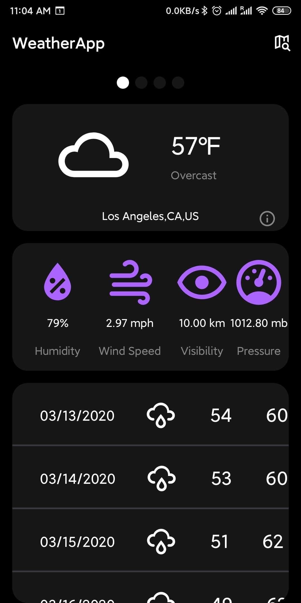
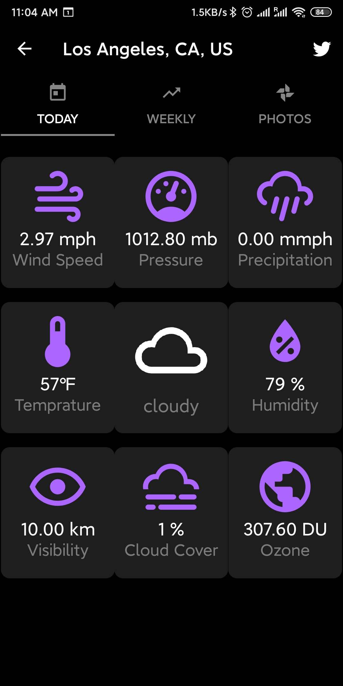
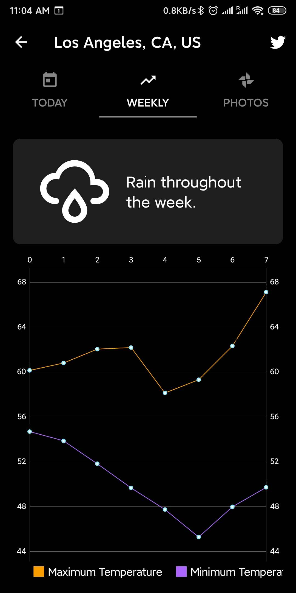
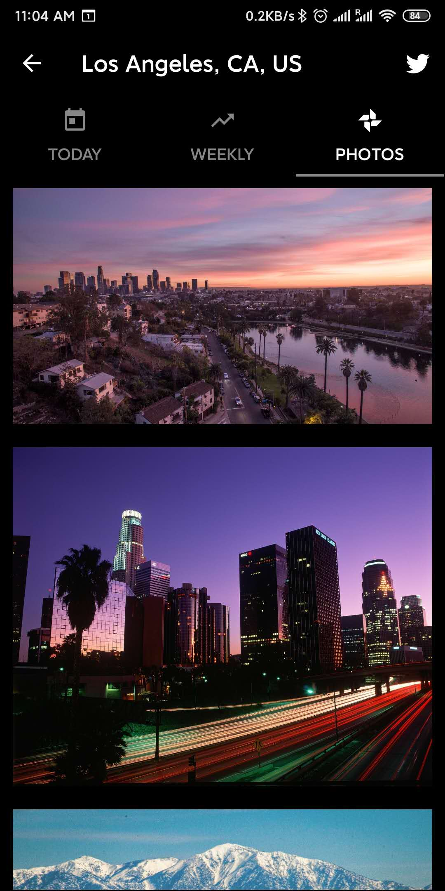
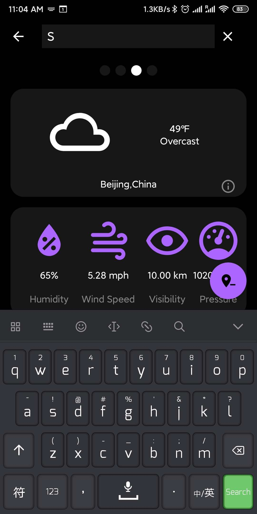

# web_technology

some project of web technology  

My homework website: http://tongmiao.freevar.com/Q1W2E3f5h7.html

USC\_CSCI571\_web\_technologies\_homework\_19\_fall  

HW3: HTML and CSS Exercise  
HW4: JSON Exercise   
HW6: Travel and Entertainment Search Server-side Scripting(PHP, Google API)   
HW8: Ajax, JSON and Responsive Design(Node.js, Google, Twitter API, Angularjs, Bootstrap, AWS)   
HW9: Place Search Android App   

 

 

 

 

